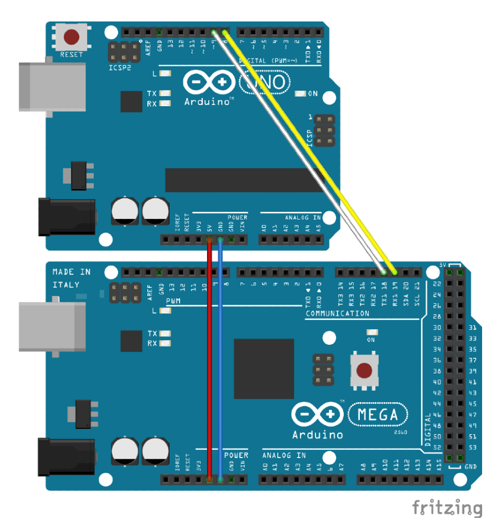

<div align="center">


[](https://github.com/speeduino/Ardu-Stim/releases/latest)
[](https://github.com/speeduino/Ardu-Stim/blob/master/LICENSE)
[](https://discord.gg/YWCEexaNDe)

##### This is the Speeduino fork of the ardustim engine simulator.
</div>

## Ardustim

Ardustim is an engine simulator built on the Arduino platform. It produces simulated crank and cam signals that can be used for testing aftermarket ECUs as well as being a useful tool for the development of firmware for these

This version is a fork of the original by David Andruczyk [https://gitlab.com/libreems-suite/ardu-stim](https://gitlab.com/libreems-suite/ardu-stim) and is intended to provide a more modern, cross platform GUI as well as continued expansion of the trigger pattern library. It was primarily developed for use by the Speeduino community, but can be utilised for testing virtually any aftermarket ECU system

## Wiring

- **Arduino Uno**
  - pin `8` will provide the `crank` or primary wheel signal
  - pin `9` will provide the `cam` or secondary wheel signal
- **Arduino Mega**
  - pin `53` will provide the `crank` or primary wheel signal
  - pin `52` will provide the `cam` or secondary wheel signal

Example for `Arduino Uno` connected to `Speeduino v0.4 Series` board with `Arduino Mega`:



## Build

The source code can be built in either PlatformIO or the Arduino IDE and does not have any dependencies on 3rd party libraries that were used in the original version of Ardustim (Eg SerialUI)

Simply open the `ardustim` sub-folder in PlatformIO or the Arduino IDE and it should compile up.

Intended hardware platform is the Arduino Nano or Diecimila.

## Installing GUI from Source

### Pre-Requisites

- NPM - https://www.npmjs.com/get-npm
- Python
- Git

### GUI Installation steps

```bash
$ git clone https://github.com/speeduino/Ardu-Stim.git
$ cd Ardu-Stim/UI
$
$ npm install electron-rebuild -g
$ npm install
$ npm start
```
